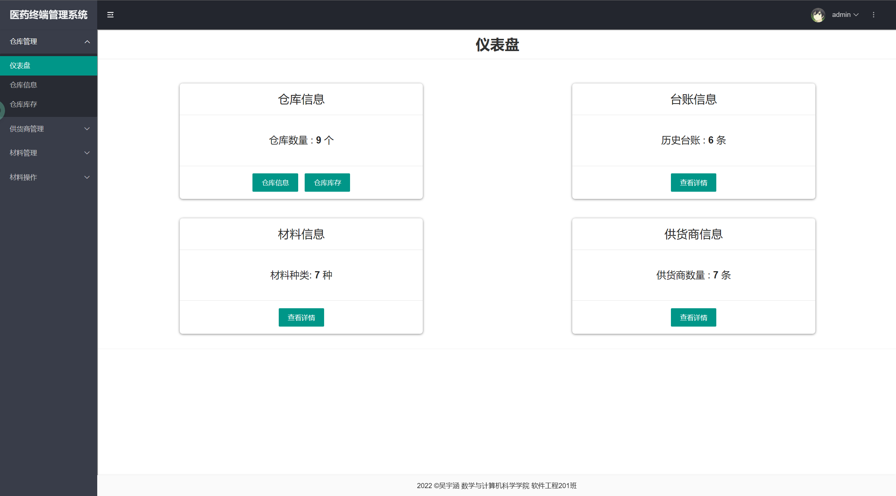
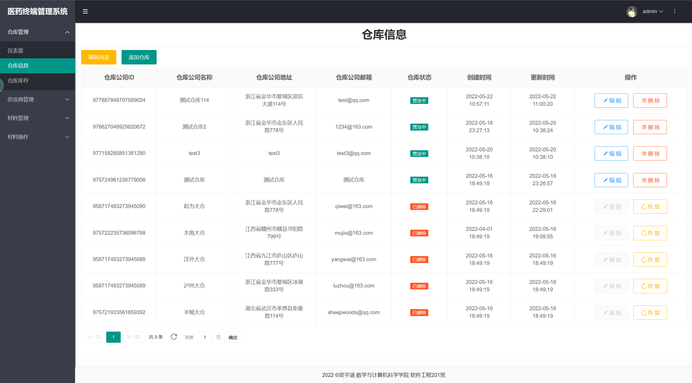
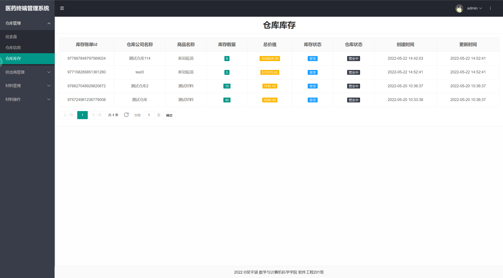
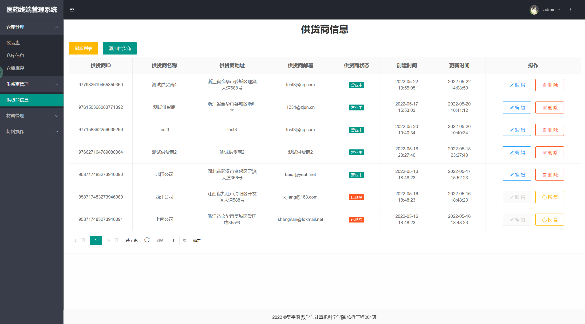
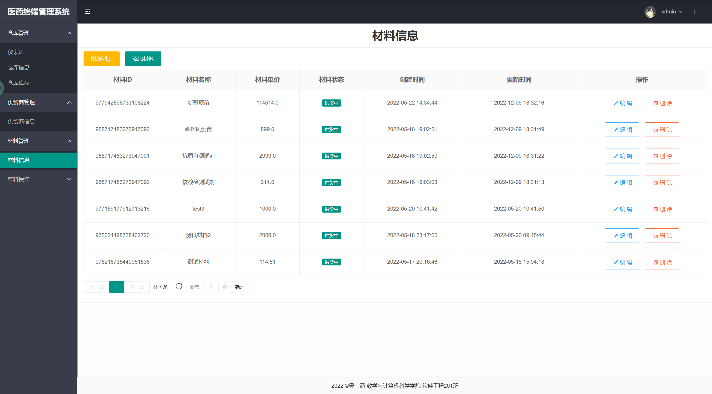
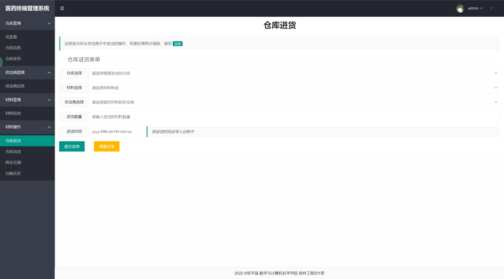
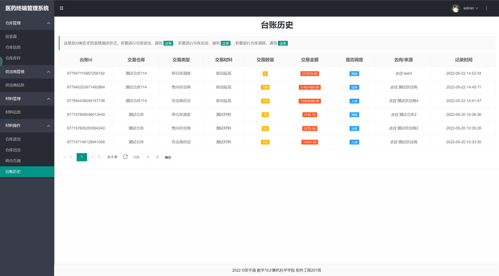

# warehouse system
> 一个简单的仓库管理系统demo，使用JSP与layui实现

使用架构：
- MySQL 5.7.26
- OpenJDK8
- Tomcat 9.0.44

运行方式：

使用IDEA导入本项目，配置本地Tomcat，开启本地MySQL，导入sql文件在resources/warehouse_system_sechma.sql，同时配置resources/db.properties

运行效果：

